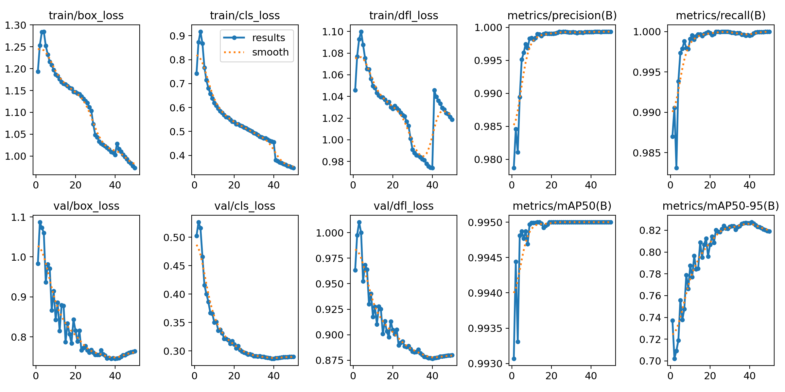
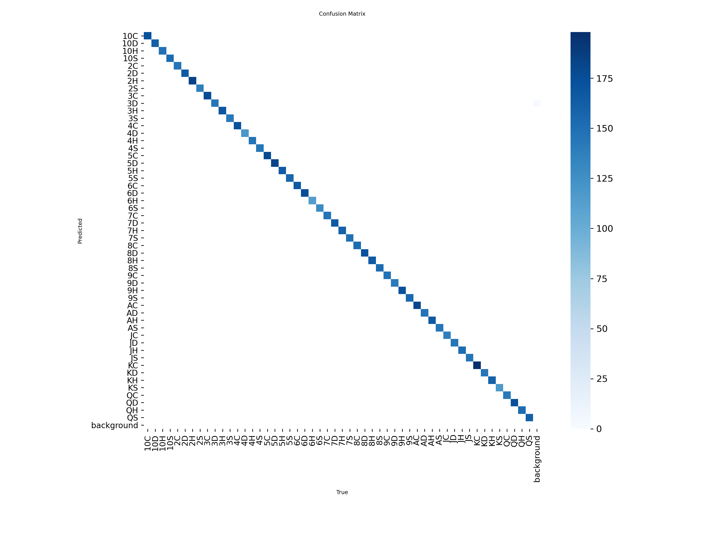
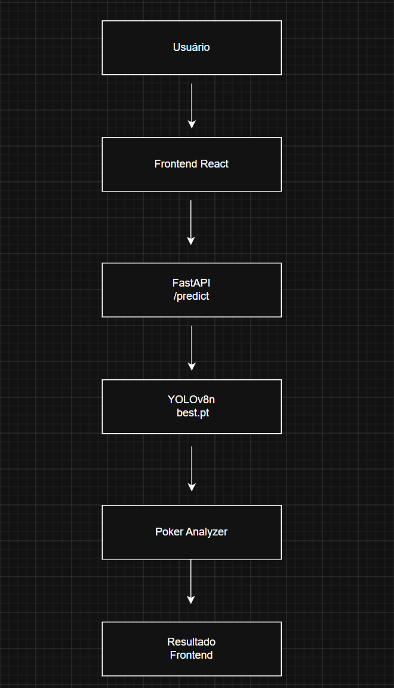

# PokerVisionAI

## Descrição

O PokerVisionAI é uma aplicação de Visão Computacional desenvolvida para identificar cartas de baralho em imagens ou pela webcam utilizando um modelo YOLO treinado especificamente para esse propósito. Após detectar as cartas presentes, o sistema realiza uma análise da mão de poker, faz um cálculo de força e observações sobre ela. 

---

## Integrante

* Gabriel Gama de Sousa Rezende
* Gabriel Nogueira Rezende
* Gabriel Pereira Rodrigues
* Heraldo Fagundes Tomaz Junior
* Lucas Mendes Polonio de Melo
* Lucas Carneiro Lozano Silva
---

## Tema do Projeto

Assistente Inteligente de Poker utilizando Visão Computacional.

---

## Tarefa de Visão Computacional

**Detecção de Objetos (Object Detection)**

O sistema identifica cartas de baralho em imagens e vídeos utilizando um modelo YOLO treinado para reconhecer as 52 cartas de um baralho padrão.

---

## Aplicabilidade

O projeto demonstra a utilização de Visão Computacional em jogos de cartas, auxiliando jogadores iniciantes a compreender melhor suas mãos e tomar decisões estratégicas.

Além do contexto de poker, o projeto exemplifica aplicações reais de detecção de objetos, classificação e análise de informações extraídas de imagens.

---

## Modelo Utilizado

### Modelo Base

YOLOv8n (Ultralytics)

### Justificativa

A variante YOLOv8n foi escolhida por apresentar:

* Baixo custo computacional;
* Alta velocidade de inferência;
* Excelente desempenho em aplicações em tempo real;
* Facilidade de execução em computadores convencionais.

---

## Dataset

### Origem

Dataset obtido através da plataforma Roboflow:

**Poker Cards Computer Vision Model**
Autor: **yolo class**

### Link

https://universe.roboflow.com/augmented-startups/playing-cards-ow27d

### Classes

O modelo foi treinado para reconhecer as 52 cartas de um baralho padrão.

Exemplos:

- AH (Ás de Copas)
- AS (Ás de Espadas)
- KD (Rei de Ouros)
- QC (Dama de Paus)

Total de classes: **52**

### Quantidade de Imagens

O dataset utilizado contém:

| Conjunto | Quantidade |
|-----------|-----------:|
| Treinamento (Train) | 21.203 |
| Validação (Validation) | 2.020 |
| Teste (Test) | 1.010 |
| **Total** | **24.233** |

### Split Utilizado

O dataset foi dividido em:

- 87,5% para treinamento
- 8,3% para validação
- 4,2% para teste

Essa divisão foi utilizada para garantir que o modelo fosse treinado, validado e testado em conjuntos distintos, evitando overfitting e permitindo uma avaliação mais confiável do desempenho.

## Treinamento

### Configurações

* Modelo Base: YOLOv8n
* Épocas: 50
* Tamanho de Imagem: 640x640
* Framework: Ultralytics YOLO
* Hardware:

  * NVIDIA GeForce RTX 4070 Laptop GPU
  * Python 3.13

---

## Resultados

### Métricas Finais

| Métrica   | Resultado |
| --------- | --------- |
| Precision | 99,93%    |
| Recall    | 100%      |
| mAP50     | 99,50%    |
| mAP50-95  | 81,91%    |

## Gráficos

### Curva de Treinamento



### Matriz de Confusão



---

## Funcionalidades

### Upload de Imagem

O usuário pode selecionar uma imagem contendo uma ou mais cartas para análise.

### Webcam

O usuário pode ativar a webcam e capturar imagens em tempo real.

### Detecção de Cartas

O sistema identifica automaticamente as cartas presentes na imagem.

### Análise da Mão

Após a detecção, o sistema:

* identifica a mão formada;
* calcula sua força;
* fornece uma recomendação estratégica.

### Histórico

As análises realizadas ficam armazenadas durante a execução da aplicação.

---

## Arquitetura da Aplicação

```text
Usuário
   ↓
Frontend React
   ↓
API FastAPI
   ↓
Modelo YOLOv8
   ↓
Poker Analyzer
   ↓
Resultado
```



---

## Endpoints da API

### GET /

Verifica se a API está online.

#### Resposta

```json
{
  "message": "PokerVisionAI API Online"
}
```

---

### POST /predict

Recebe uma imagem para análise.

#### Entrada

Arquivo de imagem enviado via multipart/form-data.

#### Saída

```json
{
  "cards": [
    "AS",
    "KH",
    "10H",
    "JH",
    "QH"
  ],
  "hand": "Sequência",
  "strength": 80,
  "recommendation": "Aposte forte."
}
```

---

## Tecnologias Utilizadas

### Frontend

* React
* Axios
* HTML5
* CSS3

### Backend

* FastAPI
* Python

### Inteligência Artificial

* Ultralytics YOLOv8
* PyTorch

### Visão Computacional

* OpenCV
* Roboflow

---

## Estrutura do Projeto

```text
PokerVisionAI
│
├── backend
│   ├── api.py
│   ├── poker_analyzer.py
│   └── best.pt
│
├── frontend
│   ├── src
│   └── public
│
├── results.png
├── confusion_matrix.png
├── architecture.png
├── README.md
└── requirements.txt
```

---

## Como Executar

### Backend

```bash
uvicorn backend.api:app --reload
```

### Frontend

```bash
npm install
npm run dev
```

---

## Arquivo de Pesos

O modelo treinado utilizado pelo projeto encontra-se em:

```text
backend/best.pt
```

---

## Considerações Finais

O PokerVisionAI demonstra a aplicação prática de Visão Computacional utilizando YOLO em um cenário de identificação de cartas de baralho. O sistema integra treinamento de modelo, API própria, interface web e análise estratégica de poker em uma solução única e funcional.
